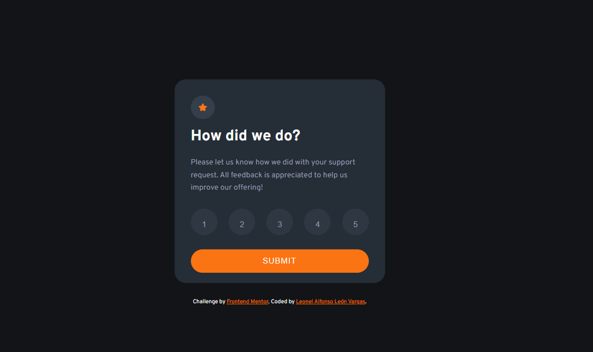
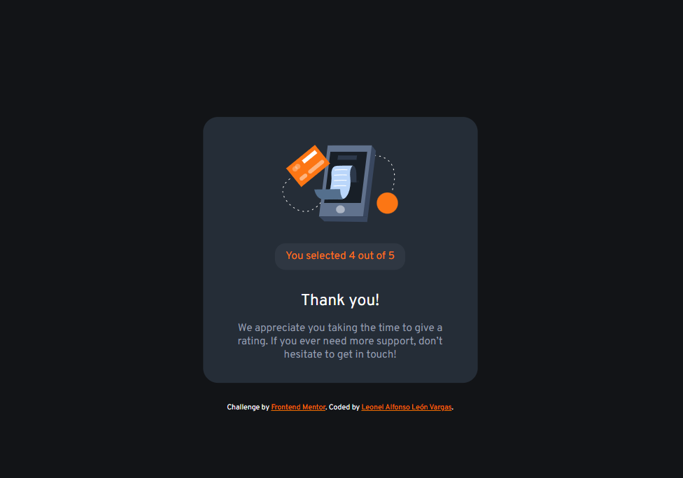

# Frontend Mentor - Interactive rating component solution

This is a solution to the [Interactive rating component challenge on Frontend Mentor](https://www.frontendmentor.io/challenges/interactive-rating-component-koxpeBUmI). Frontend Mentor challenges help you improve your coding skills by building realistic projects. 

## Table of contents

- [Overview](#overview)
  - [The challenge](#the-challenge)
  - [Screenshot](#screenshot)
  - [Links](#links)
- [My process](#my-process)
  - [Built with](#built-with)
  - [What I learned](#what-i-learned)
- [Author](#author)

## Overview

### The challenge

Users should be able to:

- View the optimal layout for the app depending on their device's screen size
- See hover states for all interactive elements on the page
- Select and submit a number rating
- See the "Thank you" card state after submitting a rating

### Screenshot

### Links

- Solution URL: https://www.frontendmentor.io/solutions/interactive-rating-component-solution-html-css-flexbox-js-PfqHqrczGP
- Live Site URL: https://leon2610.github.io/interactive-rating-component-solution/

## My process

### Built with

- Semantic HTML5 markup
- CSS custom properties
- Flexbox
- JavaScript
- Mobile-first workflow

### What I learned

- Positioning elements with flexbox and CSS
- Working with various CSS properties
- To add interaction when the user submits a rating and to send a thank you statement through JavaScript

## Author

- Github - [Leonel León](https://github.com/Leon2610)
- Twitter - [@LeoDev26](https://twitter.com/LeoDev26)